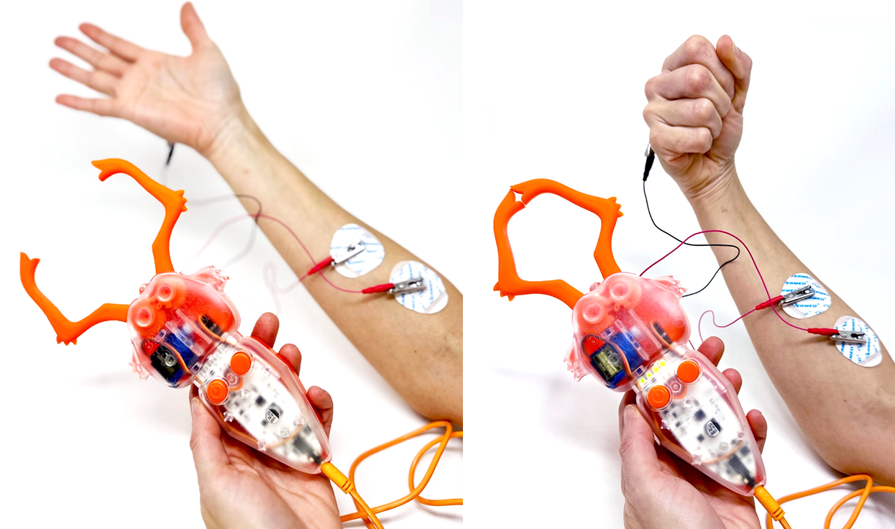

# The Claw #

This classroom-ready robotic device responds to the EMG signals of your muscles: make a grip with your fist, and the Claw's appendages close. Relax, and the Claw relaxes. Use it to stack cups or pick up different items using your brain power. The device works at the push of a button and is user-friendly enough for budding scientists as young as elementary school! Challenge mode: Try it on your back shuoulder muscles! 

## Technical Specifications ##

|||
|---|---|
|Sampling Rate (Internal) |	10k|
|Frequency Range |	100Hz – 1kHz|
|Power supply |	9V battery|
|Battery life |	8 hr|
|Auto Shut-Off |	after 10 m idle|
|Control Buttons |1. On/Off, 2.Open/Close on EMG|

[Technical Schematic](https://backyardbrains.com/products/files/theClawV1.pdf)

## Troubleshooting ##

Make sure that your electrode placement is correct, and try using another new battery.

If the LEDs change in response to flexing your muscle, but the claw doesn't move, let's put in a new battery and try pressing the Open/Close button. 
If the claw still doesn't move send us an email at hello@backyardbrains.com or give us a call at  +1 (855) GET-SPIKES (855-438-7745) 