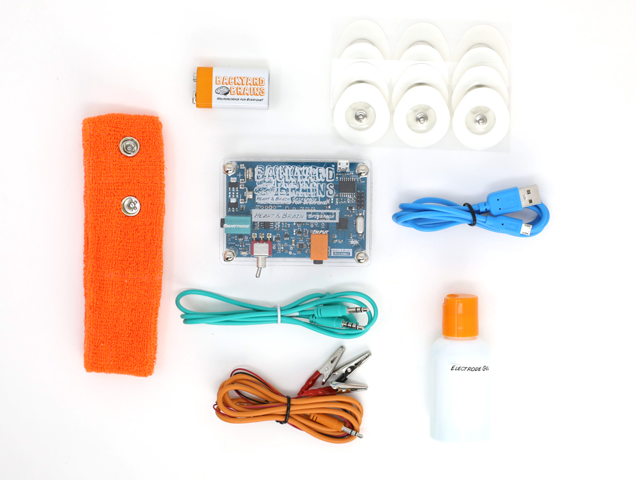

# The Heart and Brain SpikerBox #

With our Heart and Brain SpikerBox, you can view and record the action potentials of your heart (EKG) and the slow rhythms of your brain (EEG) using a Smartphone, Tablet, Chromebook, or Computer running our free Spike Recorder Software.

The EKG is the bodies' most recognizable electrical signal, making cameos in medical TV shows for decades. Our experiments take you through the steps of how to record your own, and what these signals say about you. Tap into the cerebral cortex using our EEG headband to record both brain "rhythms" as well as evoked potentials. Wait, there's more! You can also use this SpikerBox to record electrical deflections of the eye. 

## Technical Specifications ##

|||
|---|---|
|Sampling Rate|10k (1ch)|
|Frequency range|0.6Hz - 108Hz|
|Gain |3840x|
|Output|microUSB, Headphones/Smartphone|
|Inputs|1x [Orange Cable](https://backyardbrains.com/products/muscleElectrodeCable)|

[Download Schematic PDF](https://backyardbrains.com/products/files/HBSB_V2.pdf)

The [firmware](https://github.com/BackyardBrains/Heart-and-Brain-SpikerBox) on the H&B SpikerBox can be modified and uploaded through the [Arduino IDE software](https://www.arduino.cc/en/software)

## Experiments ##

[Measure Heart Action Potential](https://backyardbrains.com/experiments/heartrate)

[Record your Brain's EEG](https://backyardbrains.com/experiments/eeg)

[Detect the P300 Surprise Signal of the Brain](https://backyardbrains.com/experiments/p300)

[Learn about the Fight or Flight Sympathetic Nervous System Response](https://backyardbrains.com/experiments/Sympathetic_Nervous_System)

[Understanding the Electricity of the Eye](https://backyardbrains.com/experiments/eog)

## Troubleshooting ##

Check out the [General Troubleshooting steps](../../index.md#troubleshooting)

Upload [This firmware](https://github.com/BackyardBrains/Heart-and-Brain-SpikerBox/blob/master/V0_62/Heart-and-Brain-SpikerBox/Heart-and-Brain-SpikerBox.ino)
Using the Arduino IDE software.