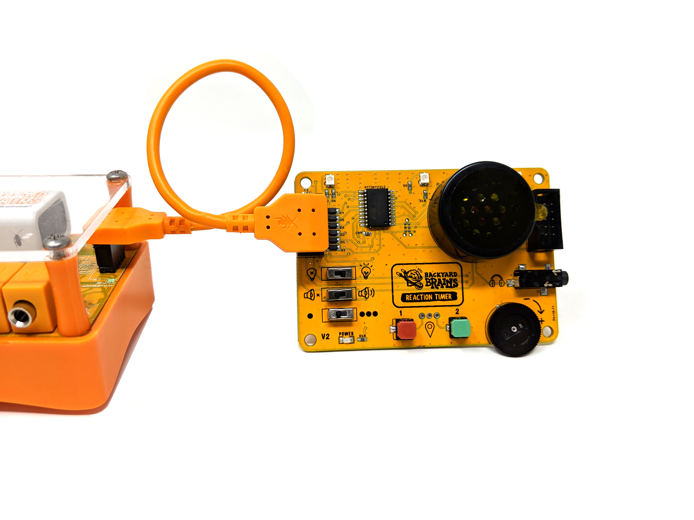

# Reaction Timer #

:::warning
Please Note: Requires a Human SpikerBox and a USB connection to an Android device, Mac, PC Desktop or iPhone/iPad with USB-C connector. Not compatible with iPhones or iPads with lightning connectors
:::

The Reaction Timer allows you to precisely quantify a person's reaction time by recording how quickly they can flex their muscles in response to a stimulus! Stimulate with two different colors of light in 3 different locations to test for visual reaction time. You can also test reactions to sound with the built-in speaker. Which will be faster? It is also possible to experiment with multiple stimuli at once for more complex experiments! The Reaction Timer will automatically insert a tick mark in line with your EMG recording for easy analysis. 

## Technical Specifications ##

3 Multi-color LEDS for visual stimulus
Loud Speaker for auditory stimulus
Experimental Settings, including: Lights on, Sounds on, Random

## Experiments ##

[How Fast can your Body React?](https://backyardbrains.com/experiments/MuscleReactionTime)

## Troubleshooting ##

