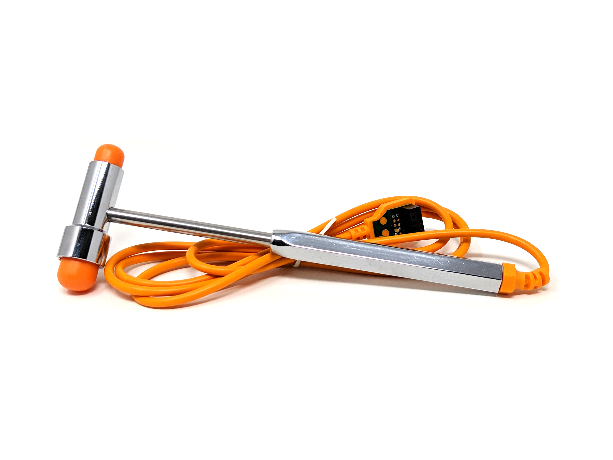

# Reflex Hammer #
:::warning
Please Note: Requires a Human SpikerBox and a USB connection to an Android device, Mac, PC Desktop or iPhone/iPad with USB-C connector. Not compatible with iPhones or iPads with lightning connectors
:::

The Reflex Hammer allows you to record exactly how fast your reflexes are. Take, for example, the Patellar Reflex: The Hammer's built-in accelerometer will put a marker into your recording the instant the hammer strikes your subject, while the Muscle SpikerBox Pro records from your quadriceps, capturing the EMG from your muscles the instant they contract in response to the reflex. Then, you can measure the time difference between when the hammer struck and when the muscles contracted in response, giving you the exact speed of the reflex arc! 

## Technical Specifications ##

Cable Length: 1.4m (Pretty long!)
LATEX FREE: The heads are made of silicone.
Doctors Agree: Quite a good thwacker!
Not Recommended for hammering nails. 

## Experiments ##
[The Patellar Reflex](https://backyardbrains.com/experiments/Musclekneejerk)

## Troubleshooting ##

