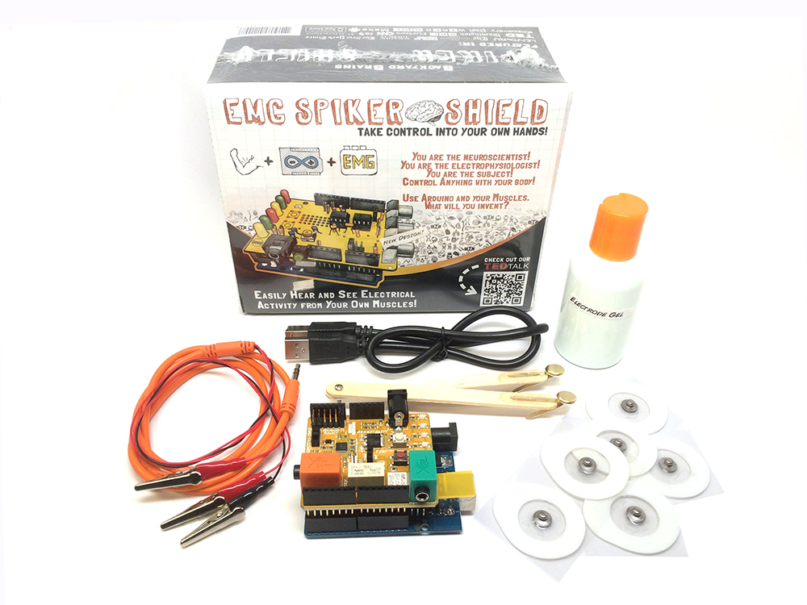
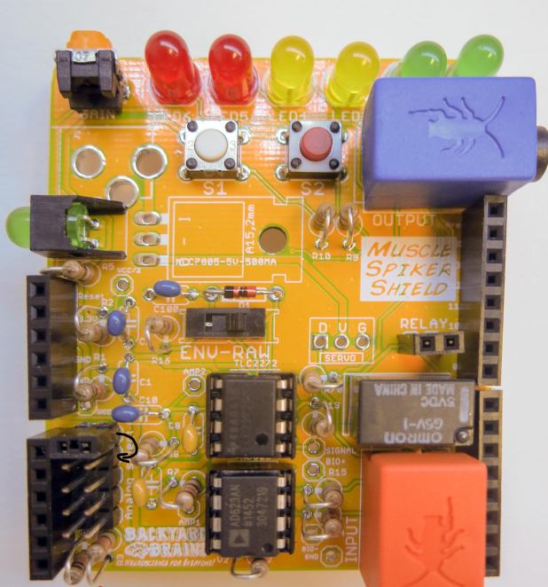

# Muscle SpikerShield #

This kit includes our fully assembled Muscle SpikerShield, a USB cable, and an Arduino. The Arduino comes preloaded with code to perform our "Getting Started" demo where you can control a bank of LEDs with your own muscle activity. Everything you need right out of the box! Just plug your Muscle SpikerShield into a USB power source (such as a computer or battery) and you are ready to go! 

## Technical Specifications ##

|||
|---|---|
|Frequency range | 50Hz-2500Hz|
|Gain|600x|
|Output|USB, Green Smartphone Cable, Blue Laptop Cable|
|Inputs|1x [Orange Cable](https://backyardbrains.com/products/muscleElectrodeCable)|

The inputs and outputs can be customized by uploading custom firmware to the Arduino UNO board.

## Stacking ##

One Muscle SpikerShield can measure one channel of EMG.
However, it's possible to stack up to 6 Muscle SpikerShields (or DIY Muscle SpikerShields) on top of a single Arduino board to have multiple EMG channels. 

Before you stack the second shield on top of the first one, move the jumper pin one field below, same principle would apply to each subsequent shield.

Note: The picture is of a DIY Muscle Shield but the same will work for the regular Muscle Shield. 
However, DIY Muscle spikershields don't come with the motor control components, so you couldn't use them for servo or stepper motors.

## Troubleshooting ##

If the power LED is on, but the EMG LED array isn't responding, Let's try a few things:
First let's try pressing the white sensitivity button on the board to cycle through the sensitivity settings, you should see one of the LEDs light up to indicate the sensitivity level.

Let's also try uploading [This Code](https://github.com/BackyardBrains/Muscle-SpikerShield/blob/master/V2_61/Muscle-SpikerShield/Muscle-SpikerShield.ino) to the arduino board, using the Arduino IDE software.

If the correct code is on the arduino board, by far the most common issue with the Muscle SpikerShield is that the pins are not making proper contact with the Arduino. This can cause a wide variety of problems and strange behavior.
The first thing we should try is separating the SpikerShield and Arduino, and bending the pins slightly, [as seen in this video](https://photos.app.goo.gl/8RVNmLtoGAXuQYiv5).
After that, make sure that the SpikerShield is pressed firmly into the Arduino board, and pull very slightly up. 