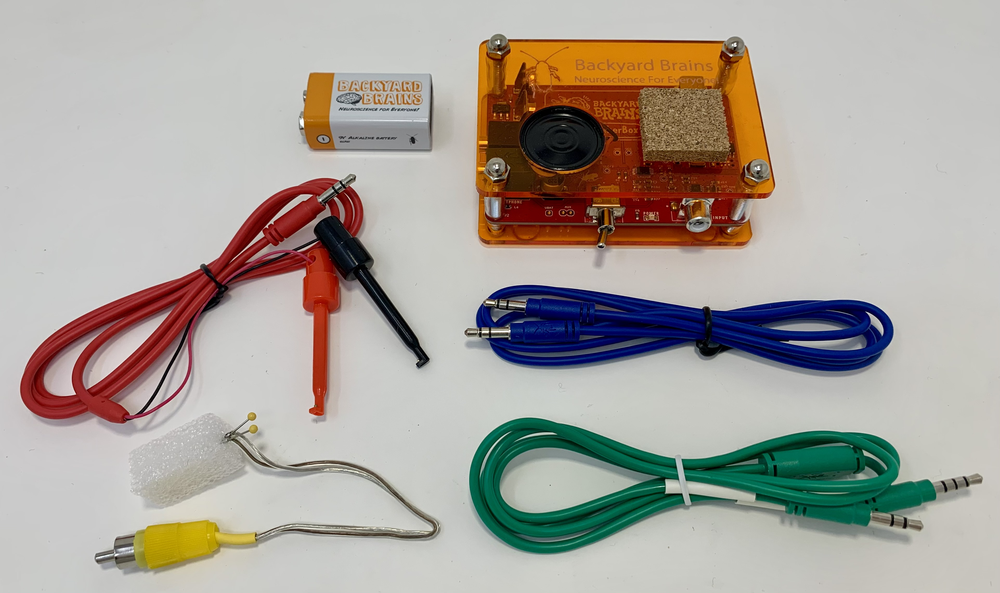

# Neuron SpikerBox Classic #

Our original classic Spikerbox. No thrills. Just neuroscience. If you are a student or an amateur scientist yearning to get your start in neuroscience, this is for you. Perhaps you're a teacher in need of an affordable, exciting, and in-depth educational tool to make learning neuroscience fun for kids or young adults. You could even be looking for a competition-destroying science fair project. Whatever your neuroscience need, the Neuron Spikerbox Classic is here to fill it! The Neuron SpikerBox is a bioamplifier that allows you to hear and see real-time electrical "spikes", or action potentials, of live neurons in invertebrates. 

This kit comes with our fully assembled Neuron SpikerBox and a variety of cables so you can hit the ground running on cockroach legs. Don't wait until you've got a big, complex electrophysiology rig assembled before you can see and listen to spikes... get the Neuron SpikerBox and record them today! 

The Neuron SpikerBox comes ready with everything you need start learning and experimenting with neuroscience. You only need to supply time, curiosity, and an invertebrate (we find that cockroaches, crickets, or earthworms work best). Once you have an invertebrate, follow the included guide and our online experiments, and soon you will be listening to the beautiful sound of live neuron spiking activity. You'll also see them in real time on your mobile device or computer. Remember: all of our software and experiments are free!

## Technical Specifications ##

|||
|---|---|
|Frequency range | 300Hz-1300Hz|
|Gain|880x|
|Output|Green Smartphone Cable, Blue Laptop Cable|
|Inputs|1x [Orange Cable](https://backyardbrains.com/products/muscleElectrodeCable)|

[Technical Schematic](https://backyardbrains.com/products/files/Neuron%20SpikerBox.v.1.42.pdf)

## Experiments ##

[Getting Started with Spikes](https://backyardbrains.com/experiments/spikerbox)

[Rate Coding](https://backyardbrains.com/experiments/ratecoding)

[Effect of Temperature on Neurons](https://backyardbrains.com/experiments/temperature)

[Microstimulation of Neurons and Muscles](https://backyardbrains.com/experiments/microstimulation)

[Referencing your Spikes](https://backyardbrains.com/experiments/referencing)

[Effect of Nicotine and MSG on Neurons](https://backyardbrains.com/experiments/neuropharmacology)

[NeuroProsthetics](https://backyardbrains.com/experiments/neuroProsthetics)

[Oxygen and Spiking](https://backyardbrains.com/experiments/oxygen)

## Troubleshooting ##

Check out the [General Troubleshooting steps](../../index.md#troubleshooting)

After connecting to spike recorder, let's ensure that we are picking up the signal from the board by quickly touching the electrode connector with your finger and afterward clap or snap near the device running Spike Recorder. You should see the graph change when touching the connector, but not when there is background audio.

The Neuron SpikerBoxes are especially sensitive to electrical noise, so taking steps to minimize it is a good idea. (Plug out any chargers from both the wall and device running spike recorder, make sure to stay away from flourecent lights are a few examples)