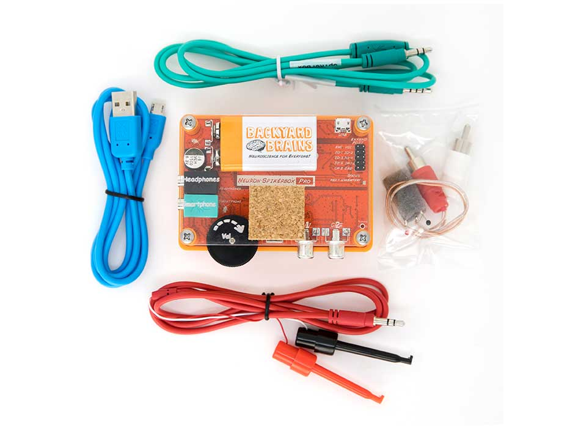

# Neuron SpikerBox Pro #

## Technical Specifications ##

|||
|---|---|
|Sampling Rate |10k (2ch)|
|Frequency Range |220-3100hz|
|Max Sound Level |104 SPL|
|Neuron Signal SNR |30dB|
|Battery Life |4hr at Full Volume, 18 hr Recording|
|Output |USB Micro, Headphones, Smartphone, 2 Analog Out|
|Inputs |2x Neuron Cables, 5x Digital Ins or 3x Digital Ins/2x Analog Ins|
|Electrical Safety |Type BF (Body Floating)|

[Technical schematic](https://backyardbrains.com/products/files/Neuron.Spikerbox.Pro.V1.pdf)

## Experiments ##
Aside from all the experiments that you can do with a Neuron SpikerBox classic, you can also do the following experiments:

[How fast are action potentials?](https://backyardbrains.com/experiments/NeuronSpikerBoxPro)

[How do neurons encode information?](https://backyardbrains.com/experiments/ratecoding)

[What is the effect of temperature on neurons?](https://backyardbrains.com/experiments/WormTemperature)

[Does the size of the axon change the speed?](https://backyardbrains.com/experiments/wormstretch)

## Troubleshooting ##

Check out the [General Troubleshooting steps](../../index.md#troubleshooting)

After connecting to spike recorder, let's ensure that we are picking up the signal from the board by quickly touching the electrode connector with your finger and afterward clap or snap near the device running Spike Recorder. You should see the graph change when touching the connector, but not when there is background audio.

The Neuron SpikerBoxes are especially sensitive to electrical noise, so taking steps to minimize it is a good idea. (Plug out any chargers from both the wall and device running spike recorder, make sure to stay away from flourecent lights are a few examples)