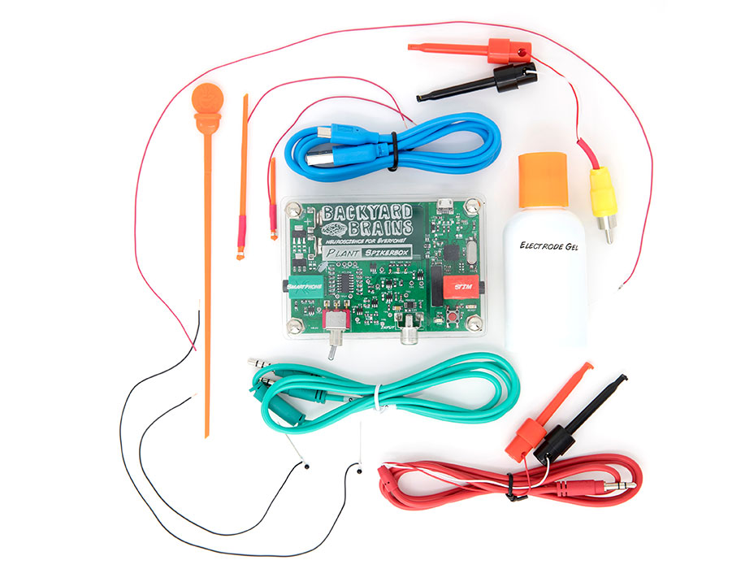
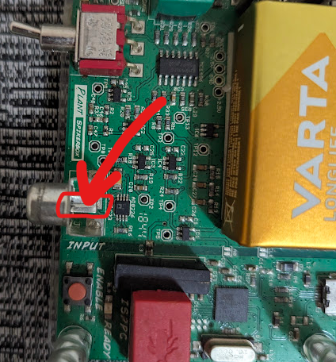

# Plant SpikerBox #

Our Plant Spikerbox allows you to perform data-driven experiments between various species of plants!
This easy-to-use device records and visualizes the signals emitted by plants, offering users the unique opportunity to peer into the fascinating world of plant signaling and plant behaviors.

## Technical Specifications ##

|||
|---|---|
|Frequency range |0.07Hz-8.8Hz|
|Gain|72x|
|Output|Green Smartphone Cable, Blue Laptop Cable, microUSB, plant stimulation cable|
|Inputs|1x Plant electrode cable consisting of two silver wires|

[Technical Schematic](https://backyardbrains.com/products/files/PSBV0.24.pdf)

## Experiments ##

[Discover how Venus Flytraps detect and trap their prey!](https://backyardbrains.com/experiments/Plants_VenusFlytrap)

[Learn about the Sensitive Mimosa Pudica and it's beautiful, folding leaves.](https://backyardbrains.com/experiments/Plants_SensitiveMimosaPudica)

[Interspecies Plant-Plant-Communication: See how one plant controls the behavior of the other.](https://backyardbrains.com/experiments/Plants_plantplantcommunicator)

## Using Other Plants ##

In our experiments we focus on “behaviour plants” like the Mimosa Pudica and Venus Flytrap because they provide a reliable signal for us to measure, and they’re visually interesting as well.

You can record signals from other plants as well, however, they will probably be somewhat less reliable.
For example, we have studied about 14 different types of agricultural plants, and found about 50% have a wound response when you burn a leaf.

The most reliable “non-rapid movement” plants are the sundew (drosera), tomato, and basil plants. You wrap a wire around a branch (apply gel), put the ground in ground, and apply a flame stimulus to a leaf. A few seconds later you should see an “alarm” wound potential.

## Troubleshooting ##

Check out the [General Troubleshooting steps](../../index.md#troubleshooting)

When doing the Plant-Plant communication experiment:
If an action potential fires, but it doesn't drop the branch, try swapping out for a fresh battery, moving the ground pin closer to the stem of the Mimosa, or adjusting the silver wire electrode's positioning or the amount of conductive gel on the branch.

You can also test the stimulation without a "master" plant by touching the middle pin on the inut connector (picture below) with a screwdriver or your finger.

You should see the red LED on the board light up for a while to indicate stimulation.
If you are connected to SpikeRecorder, you should also see the graph change dramaticaly when you do this.