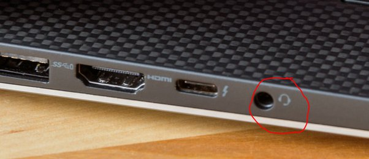
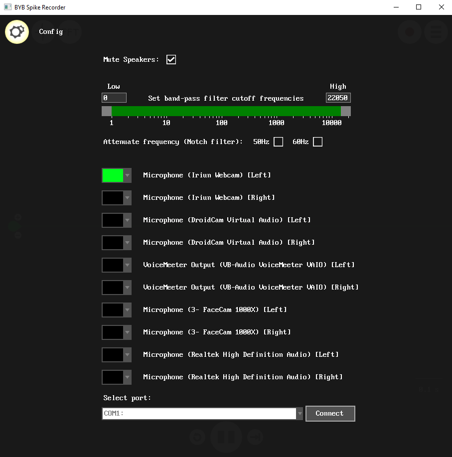
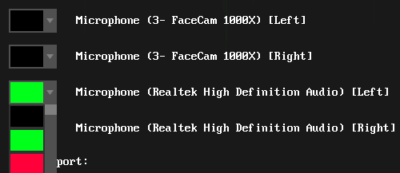

# Spike Recorder #
Our devices are ment to be used with our [Spike Recorder Software](https://backyardbrains.com/products/spikerecorder) available for Windows, macOS, iOS, Android and Linux

[Here are the manuals](https://help.backyardbrains.com/support/solutions/categories/43000367749/folders/43000574694)

## Connection Methods ##
Choosing a connection method will depend on your SpikerBox and device running Spike Recorder.

### USB ###

USB connection is possible on Windows, macOS and Android. once connected the default filter settings for the board will be set automaticaly, and the list of channels inside of the config menu will only display the data channels of the connected board, instead of the audio channels of the phone or computer.

A USB button will show up next to the FFT button to indicate a SpikerBox has been recognized, a yellow outline on the button indicates that it's connected. 

The Human SpikerBox can also be connected to iOS devices with a USB-C connector, but will not work with lightning connectors, even if an adapter is used.

### Green Smartphone Cable ###

The Green cable should be used on devices with a single combined microphone/headphone port, like tablets, newer laptops, or smartphones have.

An important note is that the Green cable is not symmetrical. Make sure that the end labeled "SpikerBox" goes into the SpikerBox

On the Android/iOS versions of Spike Recorder, the spikerbox should connect automatically.

On the computer version, once you plug in the green cable, go into the Config menu (Little gear icon in the top-left corner), below the filtering options, you should see a list of all your audio input devices(probably a lot less than on my machine)

The dropdown menus on the left side are used to select the color of the graph made from the input. Selecting black makes Spike Recorder ignore that channel.

Here, i selected green for the external audio channel on my device(Realtek), and selected black for the internal microphone(facecam 1000x in my case), to make Spike Recorder ignore it.

### Blue Laptop Cable ###
The blue cable should be used on devices that have separate individual ports for headphones and microphones. The setup will be the same as for the green cable

## General Troubleshooting ##

### All I'm recording is background audio! ###

If you are getting a lot of noise in Spike Recorder, it’s likely that it is recording from your device’s microphone, and that it hasn’t connected to your SpikerBox. You can test this by clapping near your device, and seeing if the graph responds.
If you are connecting via USB, you should see this symbol:

If not, try to follow this order of steps: Turn on the SpikerBox → Turn on the SpikeRecorder App → Connect the SpikerBox to the computer via USB.
For Android: Turn on spikerBox -> Connect USB cable -> Turn on Spike Recorder

## Connecting To Other Software ##

If you are using the blue or green cable to connect, you can use any program that can record audio, such as Audacity. Keep in mind that the Plant SpikerBox as well as the Heart and Brain SpikerBox use amplitude modulation (AM) with a 5kHz carrier signal, that is removed in Spike Recorder.

If you are connecting via USB, you can load the data directly into your own program as well, here are a few resources for setting up your own host software:

[Implementation Guide for SpikerBox Host Software](https://github.com/BackyardBrains/SpikerBoxPro/blob/master/Muscle/documentation/SpikeRecorderHIDspecification.pdf)

[Example Python Script](https://raw.githubusercontent.com/BackyardBrains/SpikeTools/master/spikerecorder.py)