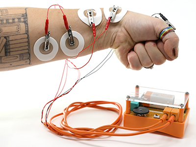
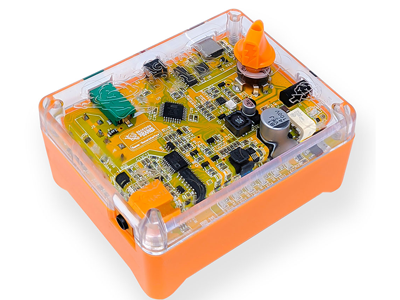
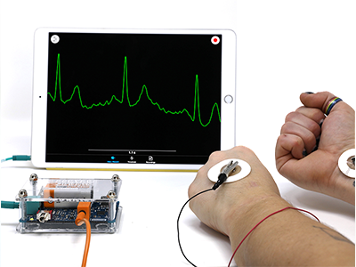
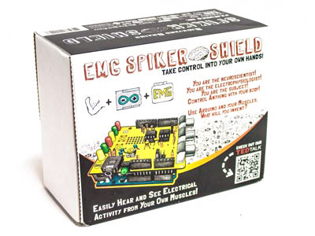
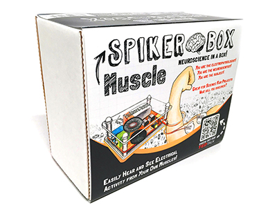
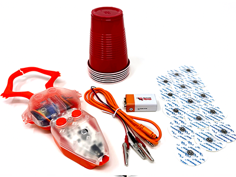
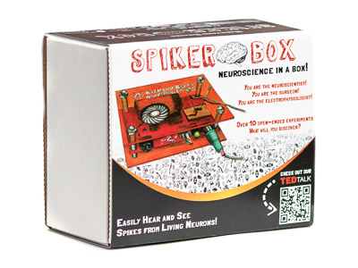
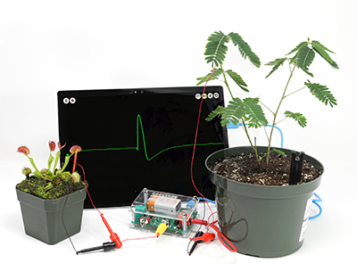

# Devices #

Our devices are meant to be used with our SpikeRecorder app. Although other options are certainly possible.

## What device should i get? ##

Whether you're interested in Human, Insect, or Plant electrophysiology, we've got you covered!

Here's an overview for each device in each category:
### Human ###

#### [Human SpikerBox](./Human/HumanSB/index.md) ####

If you're interested in the widest range of experiments, this is the right choice. It can record 2 channels of EEG,EOG,EMG or EKG. It also supports several addon devices.
Has a built in speaker, and an expansion port so you can build your own addon devices as well. 

#### [Human-Human Interface](./Human/HHI/index.md) ####

You've probably seen the HHI in action. It can record 1 channel of EMG, and can also stimulate a second person's muscle. Great for demos.

#### [Heart and Brain SpikerBox](./Human/H&BSB/index.md) ####

Can record 1 channel of EEG, EKG, or EOG. It uses the same microcontroller as the Arduino Uno, so you can write your own firmware and upload it through the Arduino IDE software.

#### [Muscle SpikerShield](./Human/MuscleSS/index.md) ####

Can record 1 channel of EMG. Comes with an Arduino Uno and leaves plenty of pins exposed, so if you're looking to build a human-machine interface, it's a great choice.

#### [Muscle SpikerBox](./Human/MuscleSB/index.md) ####

Can record 1 channel of EMG. 
Has a built in speaker so it's good for classrooms.

#### [Claw](./Human/Claw/index.md) ####

The claw doesn't have a way to make EMG recordings, but it does have an EMG indicator LED array on the board itself. Great for demos and teaching about prosthetic devices.

### Insect ###

#### [Neuron SpikerBox Pro](./Insect/NSBpro/index.md) ####

Can record 2 channels, which makes experiments like Measuring Conduction Velocity possible.

#### [Neuron SpikerBox Classic](./Insect/NSBclassic/index.md) ####

Can record 1 channel. Enables you to see and hear neuron action potentials in real time.

### Plant ###

#### [Plant SpikerBox](./Plant/PlantSpikerBox/index.md) ####

If you're interested in the still understudied field of plant electrophysiology, this is the right choice. 

## Troubleshooting ##

For every board, first make sure that the power LED turns on, and stays on steadily.
Also try using a new battery.
If your spikerbox has a speaker or signal indicator array, we can easily check if it's getting a signal. Let's also try connecting to SpikeRecorder.

If you're having trouble connecting to SpikeRecorder, check out the [SpikeRecorder troubleshooting section](./Software/SpikeRecorder/index.md#general-troubleshooting)

Check out the individual troubleshooting section on the device page of your device.

You can also send us an email at hello@backyardbrains.com or give us a call at  +1 (855) GET-SPIKES (855-438-7745). We're available Monday - Friday 9am - 5pm EST.