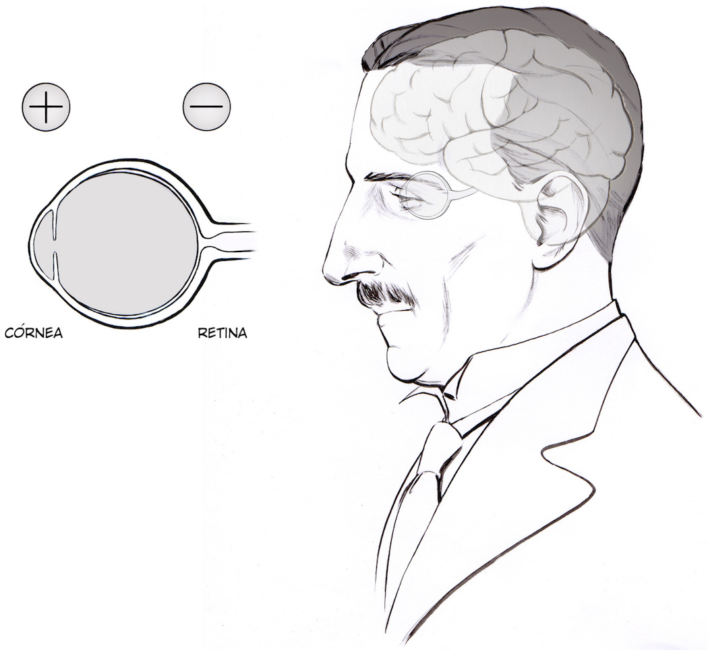
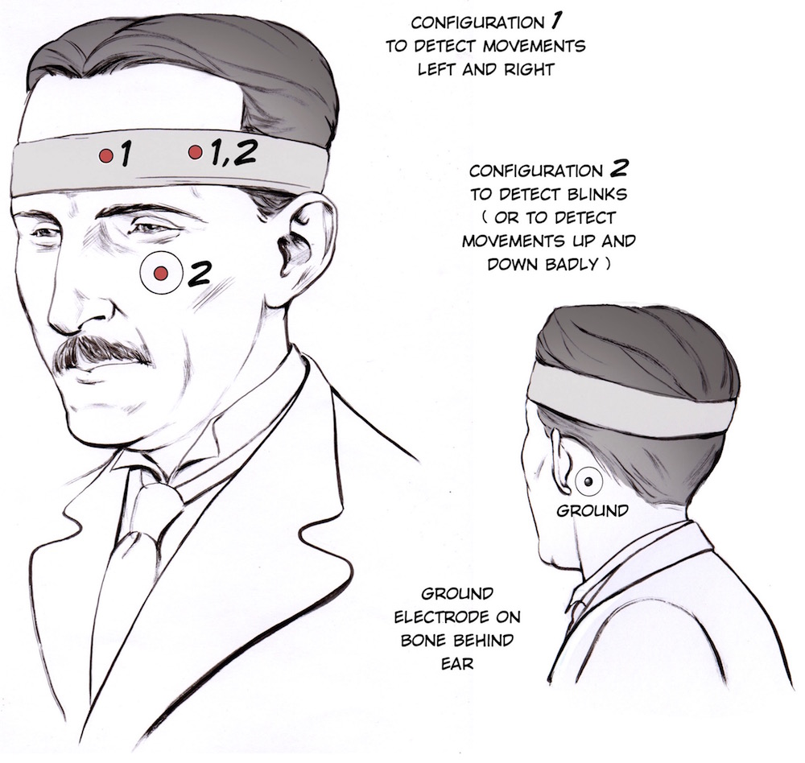

# Eye Potentials (The EOG) #

We've shown the electrical signals from your heart and brain, now it is time for another symbolically powerful organ: the eye.

:::info
Time: 1 hours
Difficulty: Advanced

What will you learn?

With this experiment, you will learn about the potential across the eye and how to measure it.

:::
:::info Equipment

Heart & Brain SpikerBox or Human SpikerBox

:::
## Background ##

Inspired by a prototype built by José Enrique López Pérez, student of Electronic Engineering in Oaxaca, Mexico.

While it is fairly well known that your heart and brain generate electrical potentials, you may not know that your whole eye has a potential as well! It does not change quickly in the form of "impulses" like your heart and brain, but does have a voltage difference we can measure. Specifically, the front of the eye, where the cornea is located, is more positive than the back of the eye (where the retina is).

With this potential difference, the eye is an electric dipole. And when dipoles move, they cause electric field changes that can be observed. By moving the eyes from left to right or up and down creates an electrical deflection we can measure called an electrooculographic signal (EOG). By placing the electrodes of our BYB headband so that each electrode lies on either side of the eye, we can detect left vs right movement. By having one electrode above the eye and another electrode below the eye, we can detect up and down movements along with blinks. Blinks? What is this about blinks! Yes, we can detect blinks too! However, we believe this is due to the electromyographic signal of the eyeblink muscles, and not the movement of the eye. But, with this you can make interesting interfaces like blink detectors.

Now let's observe and measure the signal!

:::note Downloads

    Before you begin, make sure you have the Backyard Brains Spike Recorder installed on your computer or mobile device. 
    The Backyard Brains Spike Recorder program allows you to visualize and save the data on your computer/tablet/phone when doing experiments.

    [Spike Recorder Software for Displaying and Saving Data on Computer of mobile device](https://backyardbrains.com/products/spikerecorder)

:::

## Procedure ##

    In this "Eye Potential" experiment, we are going to measure the change in eyeball potentials as we move our eyes.

        We will start with Left vs. Right movements of the eye. Take your BYB headband, and place it such that the electrodes are positioned on either side and eye.\
        Add globs of electrode gel underneath the metal patches in the headband. \
        Now, add an electrode patch on the bony protrusion behind your ear (the mastoid process).\
        Note: An alternative electrode setup is to put both electrodes patch electrodes on either side of the temples, on the outer side of the eyes..\
        Now it's time to connect your electrodes! place the red alligator clips on the electrodes around the eye, and the black alligator clip on the ground behind your ear. Which red is in which location around the eye does not matter for introductory experiments.\
        Plug the electrode cable wires in to the SpikerBox, it is the orange connector.\
        Set up your SpikerBox and Spike Recorder program. Again, since this amplifier's filter settings are right in the sweet spot of house electrical systems, you will have to be very vigilant of noise in this experiment. Have your laptop and SpikerBox far from any electrical outlets, away from any fluorescent lights, etc. Also have your laptop running on battery power alone.\
        This experiment is easier with a friend to have you observe. When the signal, move your eyes left. You should see a deflection in one direction followed by a rapid deflection in another direction. If you move your eyes to the right, the signal will change polarity.\
        Now, we will try to record up and down vs blinking movements. With your headband, have one electrode above the eye, and place a sticker electrode under your eye. Place the red alligator clips on the electrodes above and below your eye, and the black ground clip on the ground behind your ear.\
        Now blink vs moving your eyes up and down. What do you observe?\
        To record the data, you can press the red record button on the Spike Recorder software.\
        And you are done! It has not escaped our notice that perhaps you could build an interface with this signal. Give it a shot! 

## Discussion / Further Work ##

        Could you use this interface to control a video game? Where would be the main problem with this?

## Notes ##

    Gracias goes to Italo Ahumada Morasky, a Chilean artist who illustrated our Serbian Hero at the request of Jose.
    Science Fair Project Ideas

        Do the potentials look different when your eyes are open or closed? Why or why not?\
        
        Experiment with the EOG electrode placement. How does it affect your signal?\
        Is the amplitude of the potential affected by how far you move your eyes? How quickly? What other variables do you think could have an effect, and why?\
        How does placement of the electrodes affect the potential generated? As in, where relative to the eye's movement, and how far from the eye. Why does it have these effects? Think about the physics of how the potential is generated, and about how electricity moves in the body.\
        Try movements that just require your eyelids-closing your eyes (slowly), squinting, opening them wide. Why or why don't we seen an EOG for these, and if we do, how does it compare to the earlier ones seen?\
        Does whether or not someone needs glasses have an effect? Why or why not? If so, what is the effect? 

