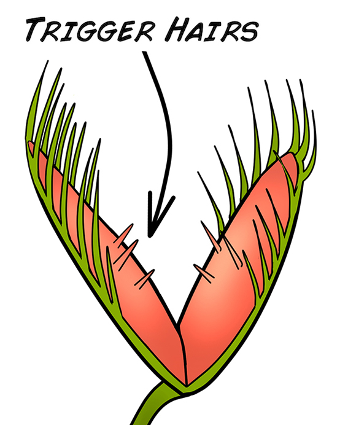
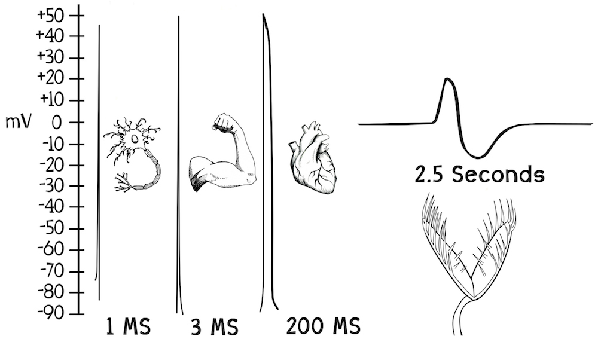
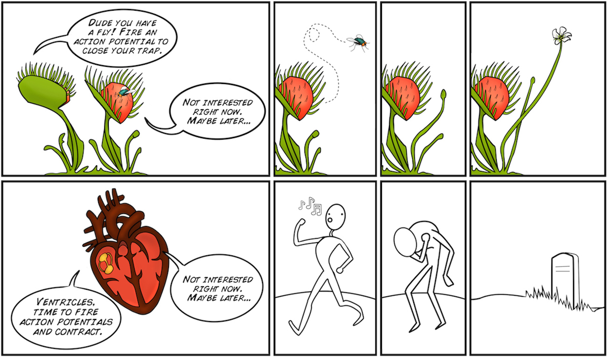
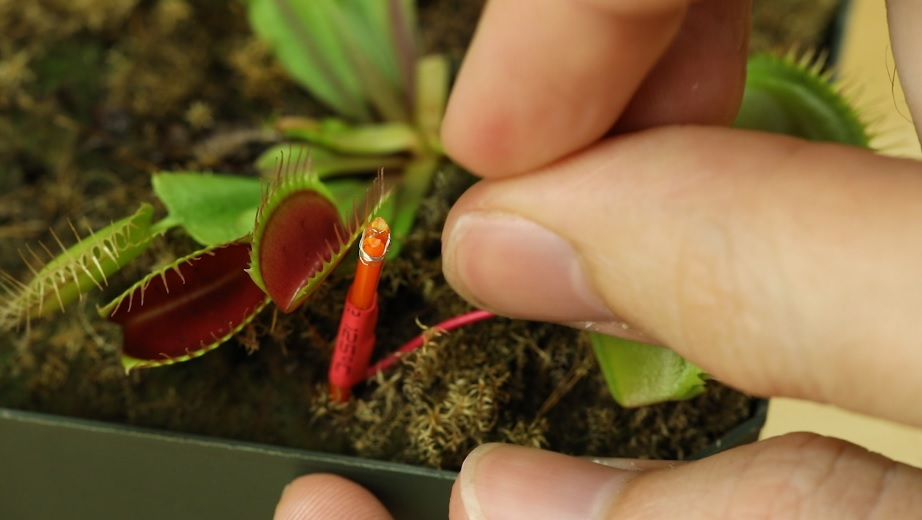
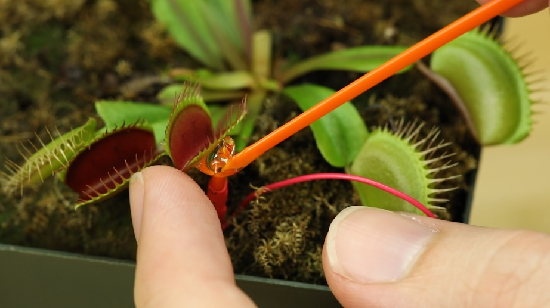
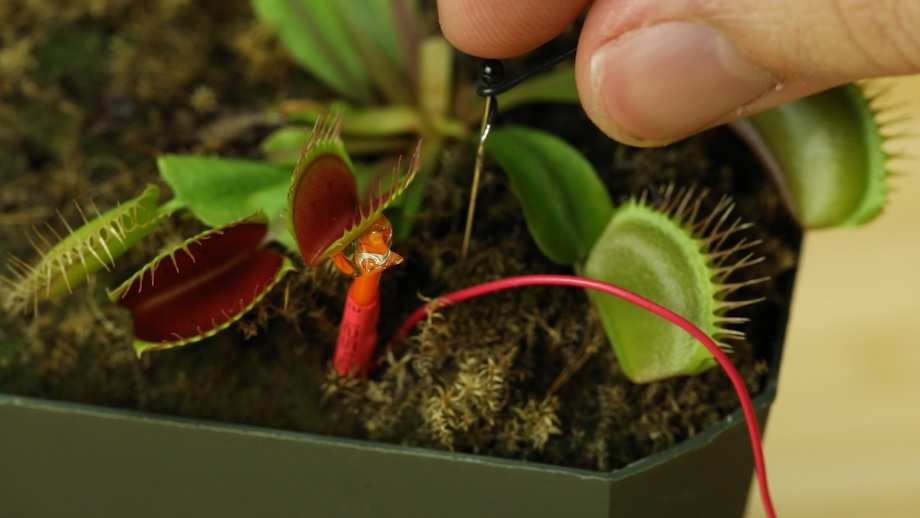
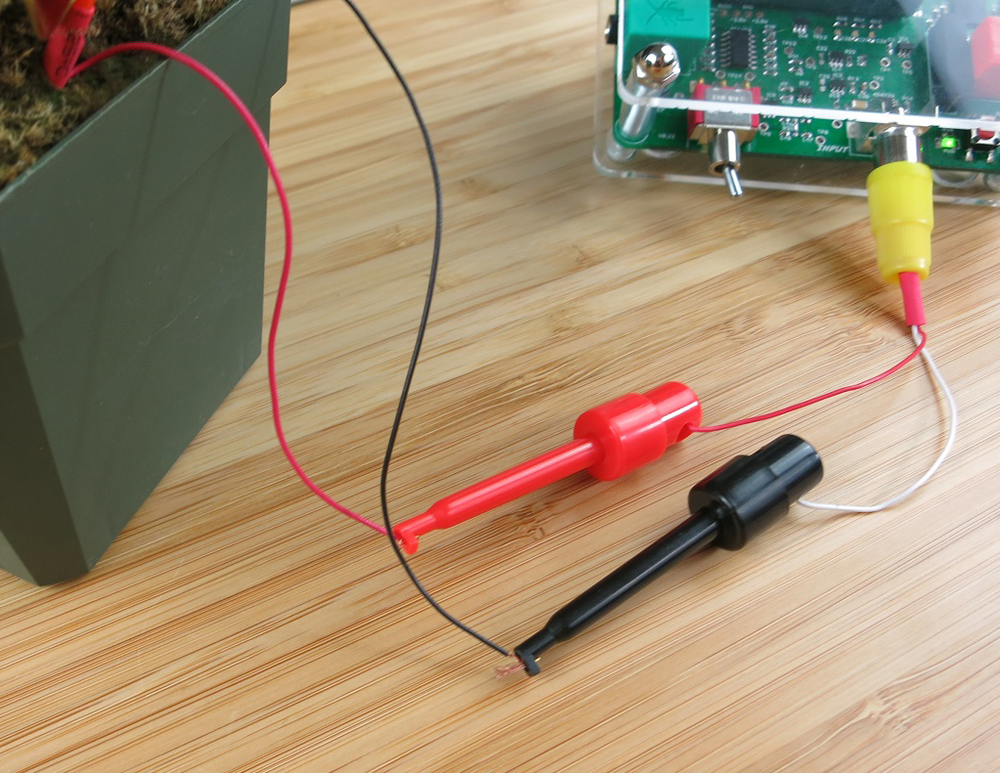
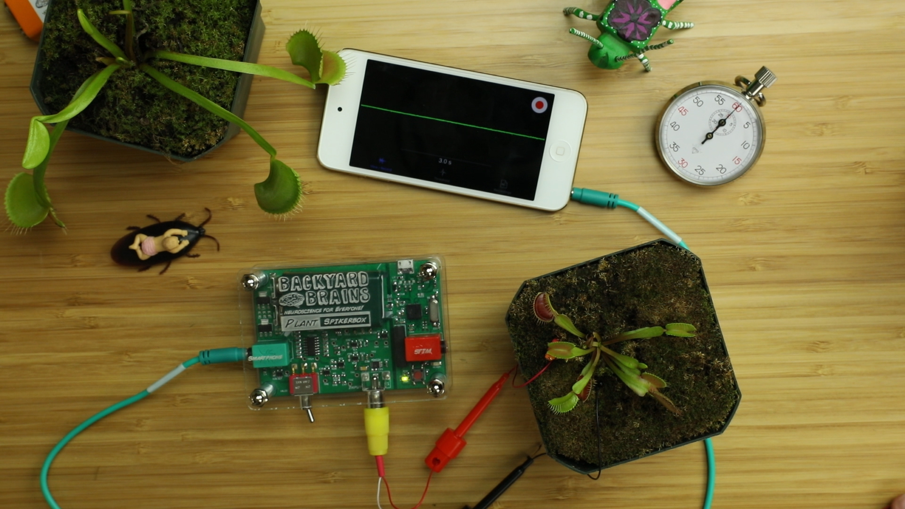
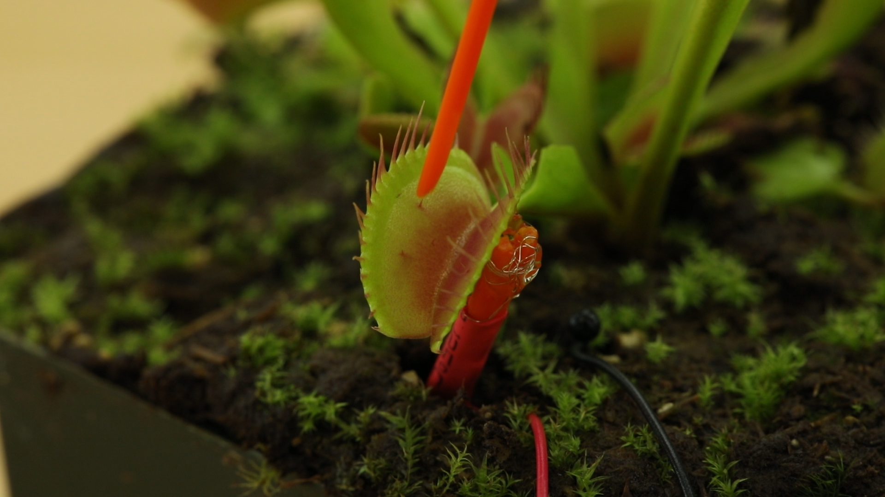
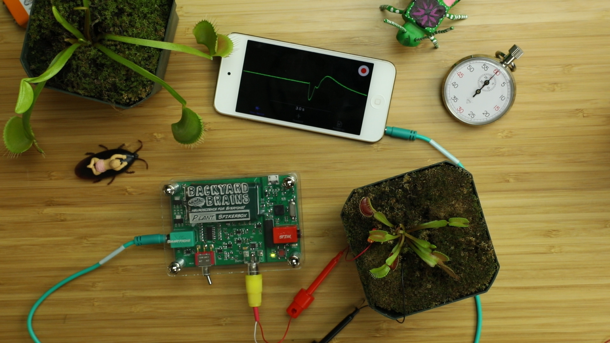

# Getting Started with the Plant SpikerBox: Venus Flytrap Electrophysiology #

Electrical impulses are not only relegated to the hearts, muscles, and brains of animals. Plants use them too to! In this plant electricity experiment, we will use the beautiful plant that Darwin himself called "one of the most wonderful in the world:" the Venus Flytrap.

:::info What will you learn?
In this experiment, featured on the TED Main Stage, you will learn about plant electrophysiology and record the Action Potential of the Venus Flytrap.

Time: 1 hour\
Difficulty: Intermediate
:::

:::info Equipment

Plant SpikerBox\
Venus Flytrap
:::

## Background ##

Your nervous system allows you to sense and respond quickly to the environment around you. You have a nervous system, animals have nervous systems, but plants do not. But not having a nervous system does not mean you cannot sense and respond to the world. Plants can certainly sense the environment around them and move. You have seen your plants slowly turn their leaves towards sunlight by the window over a week, open their flowers in the day, and close their flowers during the night. Some plants can move in much more dramatic fashion, such as the Venus Flytrap and the Sensitive Mimosa.

The Venus Flytrap comes from the swamps of North Carolina, USA, and lives in very nutrient-poor, water-logged soil. It photosynthesizes like other plants, but it can't always rely on the sunlight for food. To supplement its food supply it traps and eats insects, extracting from them the nitrogen and phosphorous needed to form plant food (amino acids, nucleic acids, and other molecules).

If you look closely at the Venus Flytrap, you will notice it has very tiny "Trigger Hairs" inside its trap leaves.

If a wayward, unsuspecting insect touches a trigger hair, an Action Potential occurs in the leaves. This is a different Action Potential than what we are used to seeing in neurons, as it's based on the movement of calcium, potassium, and chloride ions (vs. movement of potassium and sodium as in the Action Potentials of neurons and muscles), and it is muuuuuuuuucccchhhhhh longer than anything we've seen before.

If the trigger hair is touched twice within 20 seconds (firing two Action Potentials within 20 seconds), the trap closes. The trap is not closing due to muscular action (plants do not have muscles), but rather due to an osmotic, rapid change in the shape of curvature of the trap leaves. Interestingly, the firing of Action Potentials is not always reliable, depending on time of year, temperature, health of plant, and/or other factors. Quite different from we humans, Action Potential failure is not devastating to a Venus Flytrap.

We can observe this plant Action Potential using our Plant SpikerBox. Welcome to the Brave New World of Plant Electrophysiology.

:::warning Downloads

    Before you begin, make sure you have the [Backyard Brains Spike Recorder](https://backyardbrains.com/products/spikerecorder) installed on your computer/smartphone/tablet. The Backyard Brains Spike Recorder program allows you to visualize and save the data on your computer when doing experiments. We have also built a simple lab handout to help you tabulate your data. You can also download the illustrations in the experiment in a powerpoint file.
:::

## Video of Experiment ##
<iframe width="559" height="315" src="https://www.youtube.com/embed/g7qHtdkzlEo" title="The Plant SpikerBox: Venus Flytrap Electrophysiology Experiment" frameborder="0" allow="accelerometer; autoplay; clipboard-write; encrypted-media; gyroscope; picture-in-picture; web-share" allowfullscreen></iframe>

Print Materials

    If you're looking for a PDF to print and scribble on, or a google doc to edit, [check out this repository of print resources here](https://drive.google.com/drive/folders/1bE1B0DvsGNauhyj-z8YjzuBXmFYivfkR?usp=sharing)!

## Procedure ##

In this experiment, we are going to measure the Action Potentials generated by plant cells.

    Organize your Plant SpikerBox materials. For the Venus Flytrap recording, you will need one of the orange stake electrodes (short or tall), the short grounding pin with wire, the yellow RCA clip electrodes, and the electrode gel.\
    Find a Venus Flytrap. You can generally find them in museum science stores, but our favorite online supplier is Peter D'Amato's ""California Carnivores" store. If you live in Ann Arbor, MI, you can conveniently purchase them at Downtown Home & Garden\
    Select an open trap you want to record from. If it is low growing plant, press the shorter of the two orange electrode stakes into the dirt until the silver electrode wire is pressing up against the side of the trap. If it is a tall Flytrap, use the larger orange electrode stake and do the same.

    Then, apply electrode gel where the silver electrode wire touches the Flytrap. Note: In the image below, you can see the "Trigger Hairs," the three pointy spikes inside the flytrap, which you will be poking soon!

    Ground the ground in the ground! ... Stick the grounding pin with short black wire in the pot's soil.

    Plug the yellow RCA jack with black and red electrode clips into the Plant SpikerBox. Attach the Red clip to the red recording wire and the black clip to the black grounding wire.

    If you are recording on your smartphone or tablet device, plug the green Smartphone Cable into the Plant SpikerBox and into your phone (take note of the labels on either end of the cable). If you are recording on a computer, use the blue USB cable to connect your Plant SpikerBox to your computer.
    Turn on your Plant SpikerBox. You are all set up!

    Open SpikeRecorder and wait a moment for the signal to normalize. If using your phone, you are immediately connected. If using your computer, pair your Plant SpikerBox with the SpikeRecorder software by clicking the "Plant" button that appears in the upper left corner of the screen. You can adjust your signal in SpikeRecorder by zooming in or out of the y-axis or by clicking on the + o - signs on the center left side of the screen. You can zoom in or out on the time scale (x-axis) with the scroll wheel on your mouse or two finger motion on your trackpad.\
    Press the "Record" button (red button on top right of screen) to begin your recording.\
    With a plastic probe, carefully touch one of the trigger hairs once. If you double tap it, or touch two triggers, the trap will close! Don't close the trap yet!

    In the SpikeRecorder software, you should notice a large, slow Spike! This is the signal, the Action Potential, which the Venus Flytrap uses to detect prey and to close its trap!

    If your Action Potential is too big, resulting in "flat tops," either pinch to reduce the scale on your smartphone display, or on a computer click the minus button on the SpikeRecorder display.\
    Start a timer and wait 20s or more. After an Action Potential is triggered in the Flytrap it begins "Counting" (Somehow... someway... we don't quite know how). If it is stimulated again closely after the first stimulation, it will send one last Spike and then close its trap, at which point you will have to wait 1-2 days for the trap to open again...\
    After the delay, carefully poke a single trigger hair again. If all goes well, you should see another Action Potential fire and the Flytrap shouldn't close its trap.\
    If you would like to observe the Flytrap closing, quickly brush up against the trigger hairs once more, you should see one last Spike, and the Flytrap will close.\
    Stop recording.\
    To analyze the data, you can open your .wav recording files by clicking the "open button" (looks like three horizontal lines) next to the "record button" on your laptop. On your phone, select the "recordings" tab.\
    In the recording, zoom out so you can see all your Action Potentials. Record exactly how long the delay was between each Action Potential and take note of which Action Potential closed the trap. Compare the size and duration of the different Action Potentials. Now you have the tools and expertise to perform your own experiment... What's the shortest time between Spikes that the Flytrap won't close? Do larger traps have larger Spikes? What will you discover? 

## Discussion / Further Work ##
Many plants fire Action Potentials, not just the plants that dramatically move like the Venus Flytrap or the Sensitive Mimosa. There exists a whole field of study called "plant electrophysiology." A recent paper in Nature found electrical potential propagation along a plant in response to injury on one leaf. This field of is still rather small with only a handful of scientists actively engaged in it; there is plenty of room for new discoveries.

You have noticed that the Action Potential propagation sometimes doesn't occur. You can measure this as a function of temperature, time of year, etc. Also, how does the shape of the Action Potential vary from plant to plant, from trap to trap? Does the 20s clock change as a function of temperature as well? Does the time course of the Action Potential change as the plant ages?

We prefer Venus Flytrap varieties that have the traps resting on the soil. When you are trying to record from a trap on a long stem, hanging in the air, the touching of the trigger hair will cause the whole trap to sort of "wobble" which can disturb the electrode interface and cause the Action Potential shape to be distorted. The B-52 variety works well for electrophysiology.

The figures above are normalized so that the baseline is 0 mV, but the plant probably has a resting membrane potential, how would we go about measuring this? 